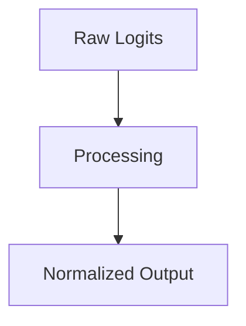

# The Softmax Centering Saturation Problem

## Overview
LayerNorm and RMSNorm mitigations.

## Diagram

## Detailed Information
This section contains detailed information regarding **The Softmax Centering Saturation Problem**. The method addresses key mathematical and computational aspects of neural network design.

[Back to Main README](../README.md)
