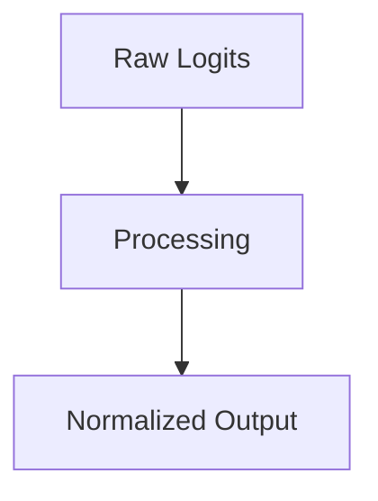

# Transformer Cross-Attention Alignment

## Overview
Multi-Head Attention weighting matrix.

## Diagram

## Detailed Information
This section contains detailed information regarding **Transformer Cross-Attention Alignment**. The method addresses key mathematical and computational aspects of neural network design.

[Back to Main README](../README.md)
