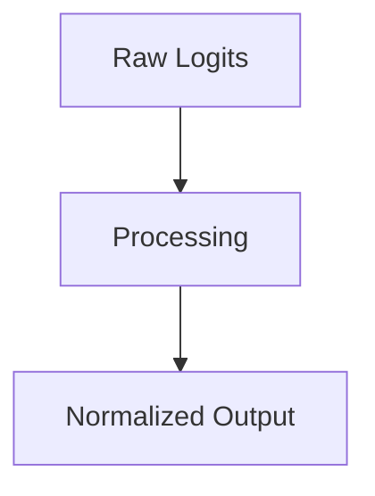

# The Online & Fused Streaming Era

## Overview
FlashAttention and Incremental Rescaling in SRAM.

## Diagram

## Detailed Information
This section contains detailed information regarding **The Online & Fused Streaming Era**. The method addresses key mathematical and computational aspects of neural network design.

[Back to Main README](../README.md)
