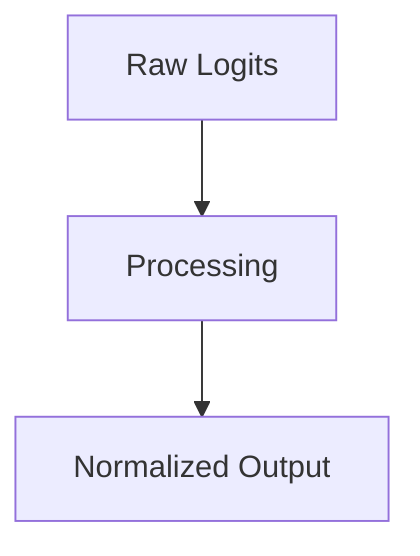

# The Foundation Era (Luce 1959 / Bridle 1989)

## Overview
Standard Softmax and its roots in statistical mechanics.

## Diagram

## Detailed Information
This section contains detailed information regarding **The Foundation Era (Luce 1959 / Bridle 1989)**. The method addresses key mathematical and computational aspects of neural network design.

[Back to Main README](../README.md)
