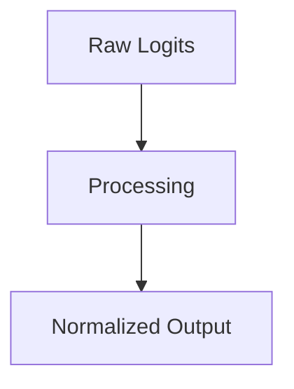

# The GPU Memory-Bandwidth Constraint

## Overview
Operator Fusion compilers and thread block execution cycles.

## Diagram

## Detailed Information
This section contains detailed information regarding **The GPU Memory-Bandwidth Constraint**. The method addresses key mathematical and computational aspects of neural network design.

[Back to Main README](../README.md)
