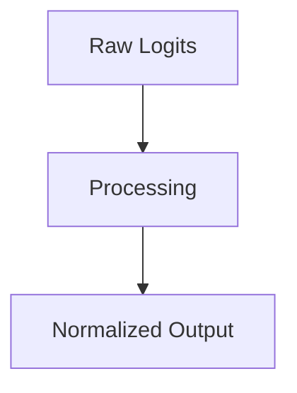

# Hierarchical Softmax

## Overview
Logarithmic scaling with balanced binary trees.

## Diagram

## Detailed Information
This section contains detailed information regarding **Hierarchical Softmax**. The method addresses key mathematical and computational aspects of neural network design.

[Back to Main README](../README.md)
