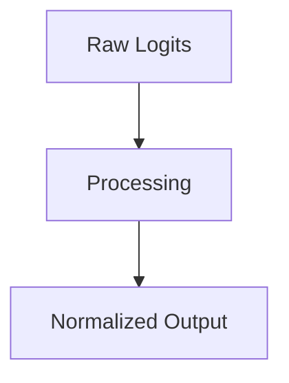

# Autoregressive LLM Sampling Layers

## Overview
Evaluating the final unnormalized vector layer.

## Diagram

## Detailed Information
This section contains detailed information regarding **Autoregressive LLM Sampling Layers**. The method addresses key mathematical and computational aspects of neural network design.

[Back to Main README](../README.md)
