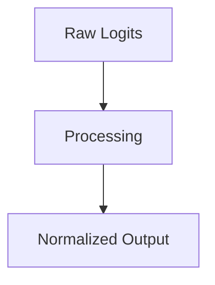

# The Log-Sum-Exp & Safe Softmax Era

## Overview
Numerical Max-Subtraction and Overflow/Underflow Mitigation.

## Diagram

## Detailed Information
This section contains detailed information regarding **The Log-Sum-Exp & Safe Softmax Era**. The method addresses key mathematical and computational aspects of neural network design.

[Back to Main README](../README.md)
