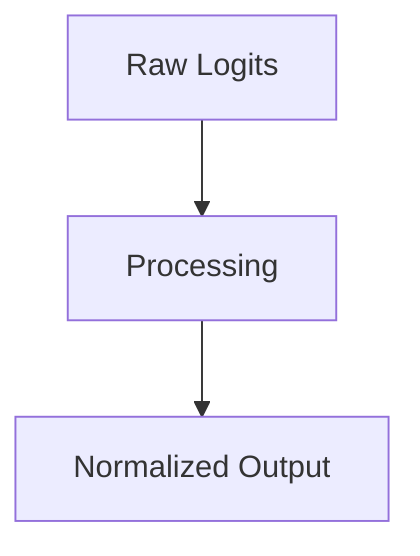

# Multi-Class Image Vision Networks

## Overview
Terminal layers for ResNet, ViT, etc.

## Diagram

## Detailed Information
This section contains detailed information regarding **Multi-Class Image Vision Networks**. The method addresses key mathematical and computational aspects of neural network design.

[Back to Main README](../README.md)
