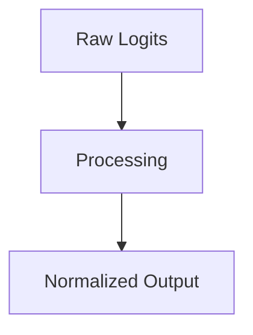

# Sparsemax

## Overview
Absolute architectural sparsity with true zeros.

## Diagram

## Detailed Information
This section contains detailed information regarding **Sparsemax**. The method addresses key mathematical and computational aspects of neural network design.

[Back to Main README](../README.md)
