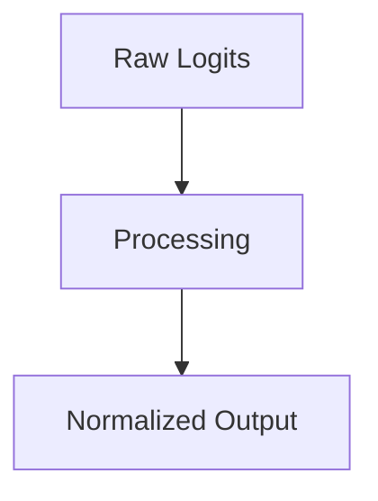

# Temperature-Scaled Softmax

## Overview
Managing creativity and randomness in LLMs.

## Diagram

## Detailed Information
This section contains detailed information regarding **Temperature-Scaled Softmax**. The method addresses key mathematical and computational aspects of neural network design.

[Back to Main README](../README.md)
